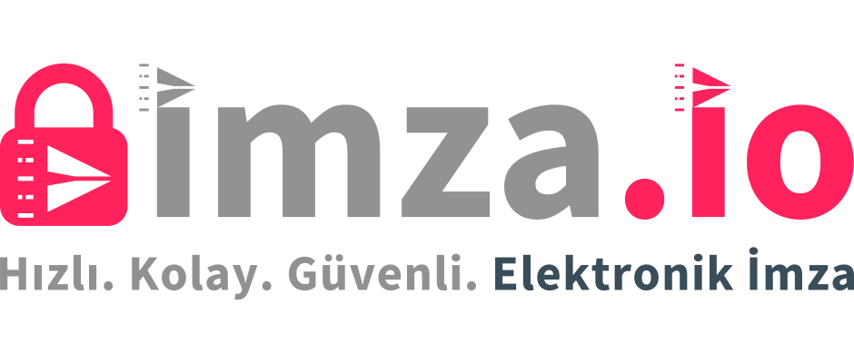

# imza.io

## 🚀 Genel Bakış

**imza.io**, bireylerden kurumlara kadar geniş kullanıcı kitlesi için tasarlanmış, sözleşme ve doküman imzalama süreçlerini dijitalleştiren bir platformdur.  
Kullanıcılar belgeleri elektronik veya mobil imza ile, hızlı ve güvenli biçimde imzalayabilir.

## 🎯 Proje Amacı

Bu proje, mevcut platform bileşenlerini .NET 10 + Visual Studio 2026 Insiders üzerinde çalışan, SignalR tabanlı gerçek zamanlı mesajlaşma altyapısını modern DevOps bileşenleriyle kurmak, gözlemlenebilir, ölçeklenebilir ve kolay dağıtılabilir bir hale getirmeyi amaçlar.

Sistem, hem geliştirici ortamında (WSL2 + Docker Desktop) hem de üretim ortamında (Docker Swarm veya ileride K3s) aynı şekilde yönetilebilecek bir mimariyi hedeflemektedir.

## 📁 Projeler

| Proje | Açıklama | Doküman |
|-------|----------|---------|
| SignalR Gerçek Zamanlı Mesajlaşma | .NET 10 + SignalR tabanlı altyapı, Docker Swarm/K3s dağıtımı | [incele](docs/projects/realtime-messaging.md) |

🔗 [imza.io Resmi Sitesi](https://imza.io)

---

## 🧩 Temel Özellikler

- **📱 Mobil ve elektronik imza desteği**  
  Belgeler mobil cihazlar veya bilgisayar üzerinden güvenle imzalanabilir.

- **⚙️ Dijital iş akışı yönetimi**  
  İmzalama, paraf ve onay süreçleri tek bir ekrandan yönetilir.

- **🔒 Uçtan uca güvenlik**  
  5070 Sayılı Elektronik İmza Kanunu’na tam uyumlu altyapı.

- **🔗 Entegrasyon kolaylığı**  
  Kurumlar mevcut sistemlerine büyük değişiklik yapmadan imza.io’yu entegre edebilir.

- **🌱 Sürdürülebilirlik**  
  Kâğıtsız ofis yaklaşımıyla maliyetleri azaltır, çevreyi korur.

---

## 💡 Değer Önerisi

- Operasyonel verimlilik ve zaman tasarrufu  
- Yasal geçerliliği olan güvenli imza altyapısı  
- Hızlı kurulum ve kullanıcı dostu arayüz  
- Mobil cihazlardan tam erişim  
- Kâğıtsız, sürdürülebilir iş süreçleri

---

## 🔧 Kullanım Senaryoları

| Senaryo | Açıklama |
|----------|-----------|
| **Şirket içi imza süreçleri** | Departmanlar arası doküman onayı ve imzası |
| **Kurumlar arası sözleşmeler** | Tedarikçi, bayi, finansal veya hukuki belgelerin dijital imzalanması |
| **Uzaktan imza** | Ofis dışında, mobil cihazlarla imzalama kolaylığı |
| **Onay/Paraf akışları** | Belgelerin birden fazla kişi tarafından paraflanması veya onaylanması |

---

## 🛠️ Teknik Özellikler

- **Platformlar:** Web, Android, iOS, Desktop (Windows/macOS)
- **Kimlik Doğrulama:** e-Devlet, Mobil İmza, e-İmza, OTP
- **Servis Entegrasyonları:**  
  - Eposta & SMS Servisleri  
  - GSM Operatörleri / MSSP  
  - ESHS / OCSP / CRL / TS Servisleri  
  - Bulut Depolama Servisleri  
- **API Desteği:** RESTful / OpenAPI / JSON  
- **Yasal Uyum:** 5070 Sayılı Kanun ve ETSI Standartları  

---

## 🧠 Kimler İçin?

- **KOBİ’ler:** İş süreçlerini dijitalleştirmek ve maliyetleri azaltmak isteyen işletmeler  
- **Kurumsal Şirketler:** Çok taraflı sözleşme süreçleri yürüten kurumlar  
- **Uzaktan Çalışan Ekipler:** Mobil imza ve onay akışına ihtiyaç duyan ekipler  

---

## 📲 Uygulamalar

- [imza.io Mobile (Google Play)](https://play.google.com/store/apps/details?id=com.imzaio.mobile)
- [imza.io iOS (App Store)](https://apps.apple.com/tr/app/imza-io/idXXXXXXXX)  
*(App Store bağlantısı güncellenecektir)*

---

## 🌍 Sürdürülebilirlik ve Gelecek

imza.io, kâğıtsız ofis vizyonuyla çevresel etkiyi azaltmayı hedefler.  
Gelecek sürümlerinde, **yapay zekâ destekli belge analizi**, **otomatik iş akışı oluşturma**,  
ve **gelişmiş entegrasyon yetenekleri** gibi yenilikler planlanmaktadır.

---

## 📞 İletişim

📧 **info@imza.io**  
🌐 [https://imza.io](https://imza.io)  
💼 [LinkedIn](https://www.linkedin.com/company/imza-io)

---

> © 2025 imza.io — hızlı, kolay, güvenli
