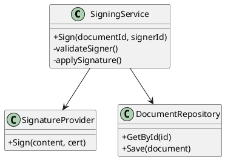

# C4: Code (Örnek, PlantUML)

Belirli bir bileşenin (ör. Belge İmzalama) örnek sınıf diyagramı.

```plantuml
@startuml
skinparam classAttributeIconSize 0

class SigningService {
  +Sign(documentId, signerId)
  -validateSigner()
  -applySignature()
}

class SignatureProvider {
  +Sign(content, cert)
}

class DocumentRepository {
  +GetById(id)
  +Save(document)
}

SigningService --> DocumentRepository
SigningService --> SignatureProvider
@enduml
```

> Not: Bu diyagram örnektir; gerçek sınıf ve metodlar proje ilerledikçe güncellenecektir.
