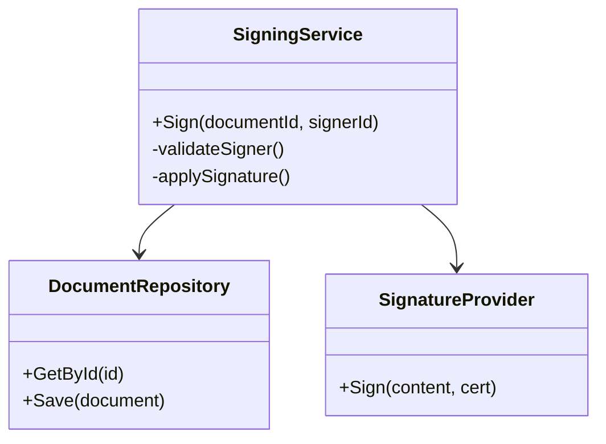

# C4: Code (Örnek)

Bu seviye, belirli bir bileşenin (ör. Belge İmzalama) örnek sınıf diyagramını temsil eder.

> Not: Bu diyagram örnektir; gerçek sınıf ve metodlar proje ilerledikçe güncellenecektir.

