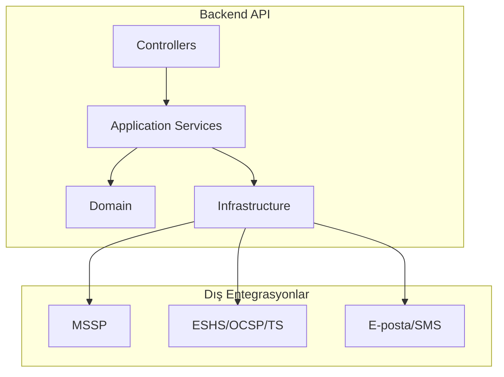

# C4: Component (Backend API)

Backend API içindeki temel bileşenler ve bağımlılıklar.

Prensipler
- Controller’lar ince, iş kuralları domain’de
- Application Services orkestrasyon ve transaction sınırları için
- Infrastructure dış kaynaklara erişim adaptörlerini barındırır

