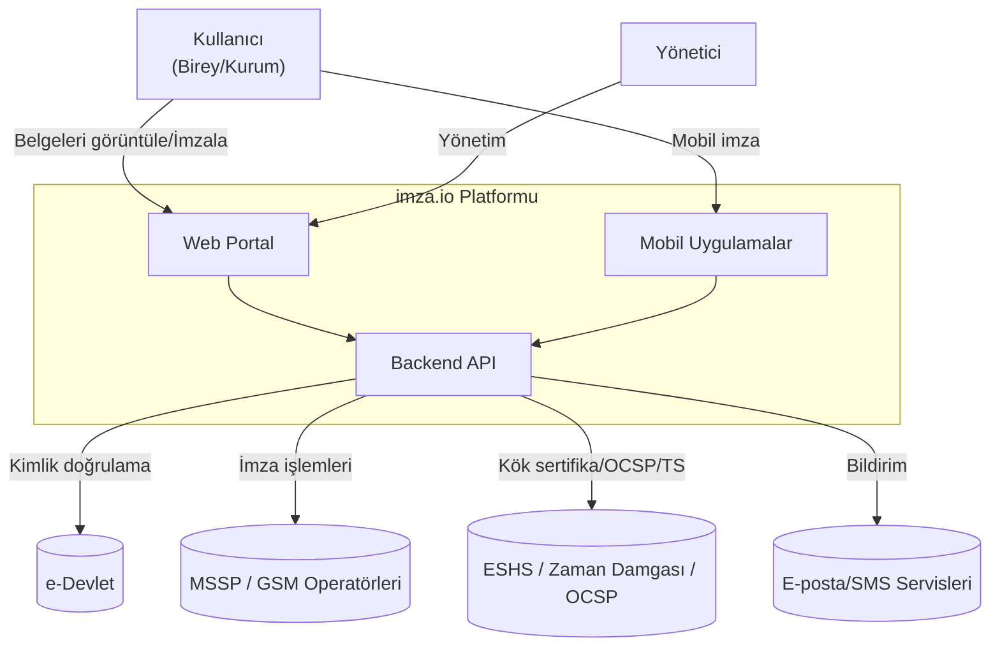

# C4: System Context

Platformun dış kullanıcıları ve komşu sistemlerle etkileşimini gösterir.

```mermaid
flowchart TB
  %% Dış aktörler
  user["Kullanıcı\n(Birey/Kurum)"]
  admin["Yönetici"]

  %% Komşu sistemler
  edevlet[("e-Devlet")]
  mssp[("MSSP / GSM Operatörleri")]
  eshs[("ESHS / Zaman Damgası / OCSP")]
  mail[("E-posta/SMS Servisleri")]

  %% Sistem
  subgraph ImzaIO[imza.io Platformu]
    portal["Web Portal"]
    api["Backend API"]
    mobile["Mobil Uygulamalar"]
  end

  user -->|Belgeleri görüntüle/İmzala| portal
  user -->|Mobil imza| mobile
  admin -->|Yönetim| portal

  portal --> api
  mobile --> api

  api -->|Kimlik doğrulama| edevlet
  api -->|İmza işlemleri| mssp
  api -->|Kök sertifika/OCSP/TS| eshs
  api -->|Bildirim| mail
```

