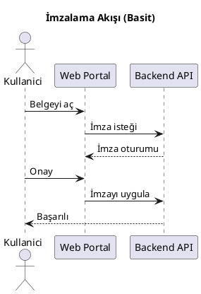

# PlantUML ile C4 ve Diyagramlar

Aşağıdaki örnekler PlantUML server kullanılarak render edilir. Markdown içinde ```plantuml blokları yeterlidir.

## Basit Akış



## C4 (C4-PlantUML ile)

Kurumsal/kapalı ağda C4-PlantUML dosyalarını dahil etmek için self-hosted PlantUML server önerilir. Açık PlantUML server üzerinde dış include genellikle desteklenir.

```plantuml
@startuml
' C4-PlantUML include'ları (açık server'da çalışabilir):
!include https://raw.githubusercontent.com/plantuml-stdlib/C4-PlantUML/master/C4_Context.puml

Person(user, "Kullanıcı", "Belgeleri görüntüler ve imzalar")
System(imzaio, "imza.io", "İmza platformu")

Rel(user, imzaio, "Kullanım")
@enduml
```

> Not: Eğer dış `!include` engellenirse, C4-PlantUML dosyalarını repoya indirip göreli yol ile `!include` kullanın veya self-hosted PlantUML Server'da `-DRELAXED_SECURITY` etkinleştirin.

