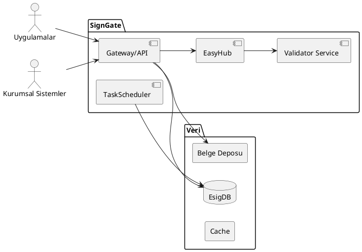

# SignGate

imza.io platformunun imza geçidi ve çekirdek imzalama yeteneklerini sağlayan ürünüdür. Elektronik/mobil imza işlemlerini, doğrulama ve sertifika yönetimi ile birlikte sunar.

Bu sayfa SignGate için teknik genel bakış, bileşenler, entegrasyonlar ve operasyonel notları içerir.

## Kapsam ve Amaç
- CAdES / PAdES / XAdES imza standartları
- Mobil imza ve e‑İmza akışları (MSSP / Akıllı Kart)
- Doğrulama (OCSP/CRL, zaman damgası)
- Sertifika yönetimi ve “Easy” akışları

## Ana Bileşenler
- Admin (ASP.NET MVC): kullanıcı/üye/müşteri yönetimi ve konfigürasyon
- Gateway (API): imza/verifikasyon uçları, dış sistemlerle entegrasyon
- EasyHub: “easy” imza senaryoları için orkestrasyon
- Validator (Java + Maven): imza doğrulama servisi (Windows Service olarak da çalıştırılabilir)
- TaskScheduler: periyodik işler (örn. sertifika bilgisi, bakım görevleri)
- UpdateService: istemci/ajan güncelleme servisi
- Demos (ASP.NET Core MVC): CAdES/PAdES/XAdES akış örnekleri
- Database/EsigDB: şema ve başlangıç scriptleri

## Mimarî (C4)

> Detaylı C4 diyagramları için: Mimari → C4 Modeli sayfalarına bakın. SignGate’e özel detaylar bu sayfadan geliştirildikçe linklenecektir.

## Dış Entegrasyonlar
- MSSP / GSM Operatörleri: mobil imza akışları
- ESHS / OCSP / CRL / TS: sertifika doğrulama ve zaman damgası
- Bildirim: e‑posta/SMS servisleri
- QR/Resim Servisi: PAdES içi QR ekleme (not: ayrı bir image servisi gerektirir)

## Geliştirici Kurulumu

Önkoşullar
- .NET SDK (proje hedef sürümüne uygun) — Çözüm: `products/SignGate/ImzaIo.ESig.sln`
- Java (Validator için, öneri: Temurin/OpenJDK 17+) ve Maven

Hızlı başlangıç
- Admin/Gateway/EasyHub projelerini Visual Studio veya `dotnet` CLI ile çalıştırın
- Validator için `products/SignGate/Validator` altındaki talimatları uygulayın
  - Ayrıntılar: [Validator Kurulumu](validator.md)
- Demos (ASP.NET Core) projeleri ile uçtan uca akışları test edin

Konfigürasyon
- .NET projeleri: `appsettings.Development.json` ve ortam değişkenleri
- Validator: `Validator/src/main/resources/application.properties` (deployment’ta dışa taşınabilir)

## CI/CD
- GitHub Actions iş akışları: `develop.yml`, `test.yml`, `uat.yml`, `prod.yml`
- Geliştirme pipeline’ı, test/UAT dağıtımları ve paketleme adımları mevcuttur

## Sürüm Yönetimi
- Ürün CHANGELOG’u: `products/SignGate/README.md` içinde sürüm notları başlıkları mevcut
- Meta repo içinde proje sürüm notları: `docs/projects/signgate/releases/`
  - v2.0.1 — Taslak: [releases/2.0.1.md](releases/2.0.1.md)
  - v2.0.0 — Ana sürüm: [releases/2.0.0.md](releases/2.0.0.md)

## Yol Haritası ve Notlar
- Sertifika non‑qualified kontrolü (README’de belirtilmiş)
- PAdES’e QR ekleme için image servisi bağımlılığı
- Sertifikalardan OCSP/CRL/TS adreslerinin otomatik okunması ve görevle saklanması

## Sahiplik
- Ürün sahibi: TBD
- Teknik sorumlu: TBD
- Ekip: TBD
